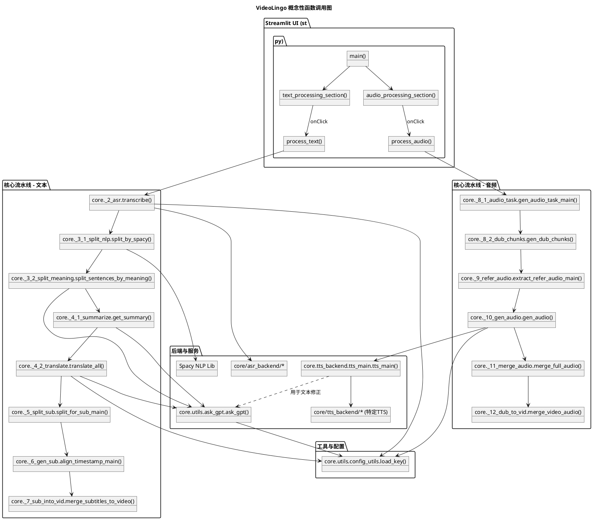

# 7. 函数调用图 (概念性)

*   **主要函数/方法列表和调用流程：** `st.py` (UI) -> `process_text()` / `process_audio()` -> 对 `core/_*_*.py` 模块的顺序调用。
*   **关键的编排函数：**
    *   `st.py:process_text()`: 调用ASR、NLP切分、翻译、字幕生成、字幕嵌入等。
    *   `st.py:process_audio()`: 调用TTS任务生成、参考音频提取、TTS渲染、音频合并等。
    *   `core.utils.ask_gpt.ask_gpt()`: LLM调用的中心点。
    *   `core.tts_backend.tts_main.tts_main()`: 分派到特定的TTS引擎。

*   **函数调用关系可视化 (PlantUML 图表)：**

(用户需要使用 PlantUML 渲染工具来从下面的文本描述中可视化此图表)

*   **高频调用路径分析：** `load_key()`, `ask_gpt()`, `tts_main()`, 片段文件的I/O操作。
*   **递归和复杂调用链识别：** 深层调用栈是正常的。通过 `ThreadPoolExecutor` 实现的并发为LLM调用增加了可管理的复杂性。无明显有害递归。
