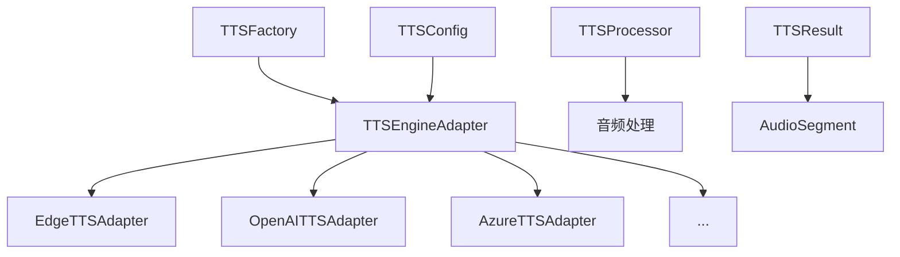

# TTS Backend - VideoLingo 语音合成后端

> 🎵 现代化的TTS (Text-to-Speech) 后端系统，支持多种语音合成引擎，使用适配器模式提供统一接口。

## ✨ 特性

- 🏗️ **适配器模式** - 统一的接口支持多种TTS引擎
- 🏭 **工厂模式** - 智能引擎管理和自动选择
- 🔄 **三阶段生命周期** - 初始化 → 配置 → 运行
- ⚡ **批量处理** - 高效的批量语音合成
- 🎛️ **音频后处理** - 合并、速度调整、音量标准化
- 🔧 **灵活配置** - 支持多种配置方式
- 🔄 **向下兼容** - 保持与原有代码的兼容性
- 🌐 **多语言支持** - 中文、英文、日文、韩文等
- 📝 **完整日志** - 详细的执行日志和错误处理

## 🚀 支持的TTS引擎

| 引擎 | 类型 | 特点 | 状态 |
|------|------|------|------|
| **Edge TTS** | 免费 | 微软免费服务，多语言支持 | ✅ 完整实现 |
| **OpenAI TTS** | 付费 | 高质量语音，6种声音选择 | ✅ 完整实现 |
| **Azure TTS** | 付费 | 企业级服务，SSML支持 | ✅ 完整实现 |
| **Fish TTS** | 付费 | 角色定制，情感表达 | ✅ 完整实现 |
| **SiliconFlow Fish TTS** | 付费 | 3种模式，声音克隆 | ✅ 完整实现 |
| **GPT-SoVITS** | 本地 | 本地部署，声音克隆 | ✅ 完整实现 |
| **SiliconFlow CosyVoice2** | 付费 | 多语言，高质量 | ✅ 完整实现 |
| **F5-TTS** | 本地 | 零样本语音克隆 | ✅ 完整实现 |
| **Custom TTS** | 自定义 | 支持任意TTS服务 | ✅ 完整实现 |

## 📦 快速开始

### 基本使用

```python
from modules.tts_backend import TTSFactory

# 创建工厂实例
factory = TTSFactory()

# 注册TTS引擎
factory.register_engine('edge_tts', {
    'voice': 'zh-CN-XiaoxiaoNeural'
})

# 语音合成
result = factory.synthesize(
    engine_name='edge_tts',
    text="你好，欢迎使用VideoLingo！",
    output_path="output.wav"
)

print(f"合成成功: {result.success}")
print(f"音频时长: {result.total_duration:.2f}秒")
```

### 直接使用适配器

```python
from modules.tts_backend.adapters import EdgeTTSAdapter

# 创建适配器
adapter = EdgeTTSAdapter({
    'voice': 'zh-CN-XiaoxiaoNeural',
    'rate': '+0%',
    'pitch': '+0Hz'
})

# 初始化和配置
adapter.initialize()
adapter.configure(adapter.config)

# 语音合成
result = adapter.synthesize("测试文本", "test.wav")

# 清理资源
adapter.cleanup()
```

### 便捷函数（向下兼容）

```python
from modules.tts_backend.adapters import edge_tts, openai_tts

# Edge TTS
success = edge_tts("你好世界", "edge_output.wav", "zh-CN-XiaoxiaoNeural")

# OpenAI TTS
openai_tts("Hello World", "openai_output.wav", "alloy", "your-api-key")
```

## 🔧 详细配置

### Edge TTS 配置

```python
config = {
    'voice': 'zh-CN-XiaoxiaoNeural',  # 声音选择
    'rate': '+10%',                   # 语速调整 (-50% ~ +100%)
    'pitch': '+0Hz',                  # 音调调整 (-50Hz ~ +50Hz)
    'volume': '+0%'                   # 音量调整 (-50% ~ +100%)
}
```

**支持的中文声音**：
- `zh-CN-XiaoxiaoNeural` (女声，自然)
- `zh-CN-YunxiNeural` (男声，活泼)
- `zh-CN-YunyangNeural` (男声，专业)
- `zh-CN-XiaoyiNeural` (女声，甜美)

### OpenAI TTS 配置

```python
config = {
    'api_key': 'your-openai-api-key',
    'voice': 'alloy',                 # 声音选择
    'model': 'tts-1',                # 模型选择 (tts-1, tts-1-hd)
    'speed': 1.0                     # 语速 (0.25 ~ 4.0)
}
```

**支持的声音**：
- `alloy` - 合金 (中性)
- `echo` - 回声 (男性)
- `fable` - 寓言 (男性)
- `onyx` - 玛瑙 (男性)
- `nova` - 新星 (女性)
- `shimmer` - 微光 (女性)

### SiliconFlow Fish TTS 配置

```python
# 预设模式
config_preset = {
    'api_key': 'your-sf-api-key',
    'voice': 'alex',
    'mode': 'preset'
}

# 动态模式（声音克隆）
config_dynamic = {
    'api_key': 'your-sf-api-key',
    'mode': 'dynamic',
    'ref_audio': 'path/to/reference.wav',
    'ref_text': '参考音频对应的文本'
}

# 自定义模式
config_custom = {
    'api_key': 'your-sf-api-key',
    'mode': 'custom',
    'voice_id': 'your-custom-voice-id'
}
```

### GPT-SoVITS 配置

```python
config = {
    'character': 'your_character_name',  # 角色名称
    'refer_mode': 1,                     # 参考模式 (1,2,3)
    'text_lang': 'zh',                   # 文本语言 (zh,en)
    'prompt_lang': 'zh',                 # 提示语言 (zh,en)
    'speed_factor': 1.0                  # 语速因子 (0.5-2.0)
}
```

**参考模式说明**：
- `1` - 使用预设参考音频
- `2` - 使用第一段音频作为参考
- `3` - 使用对应段落音频作为参考

### 自定义TTS配置

```python
# API模式
config_api = {
    'mode': 'api',
    'api_url': 'https://your-tts-api.com/synthesize',
    'api_key': 'your-api-key',
    'headers': {'Custom-Header': 'value'},
    'response_format': 'audio',         # audio, json
    'request_method': 'POST'            # POST, GET
}

# 命令行模式
config_command = {
    'mode': 'command',
    'command_template': 'python tts.py --text "{text}" --output "{output}"',
    'working_dir': '/path/to/tts/directory'
}

# 自定义函数模式
config_custom = {
    'mode': 'custom',
    'custom_processor': your_custom_function
}
```

## 🎯 高级用法

### 批量处理

```python
from modules.tts_backend.adapters import EdgeTTSAdapter

texts = [
    "这是第一句话",
    "这是第二句话",
    "这是第三句话"
]

adapter = EdgeTTSAdapter({'voice': 'zh-CN-XiaoxiaoNeural'})
adapter.initialize()

# 批量合成
result = adapter.synthesize_batch(texts, output_dir="batch_output")

print(f"成功处理: {len(result.segments)} 个音频片段")
print(f"总时长: {result.total_duration:.2f} 秒")

# 自动合并的音频文件路径
print(f"合并音频: {result.output_path}")

adapter.cleanup()
```

### 工厂模式高级用法

```python
from modules.tts_backend import TTSFactory

factory = TTSFactory()

# 注册多个引擎
factory.register_engine('edge_tts', {'voice': 'zh-CN-XiaoxiaoNeural'})
factory.register_engine('openai_tts', {'api_key': 'your-key', 'voice': 'alloy'})

# 设置默认引擎
factory.set_default_engine('edge_tts')

# 使用默认引擎
result = factory.synthesize_default("使用默认引擎", "default.wav")

# 自动选择最佳引擎
result = factory.auto_synthesize("自动选择引擎", "auto.wav")

# 获取引擎信息
engines = factory.get_available_engines()
print(f"可用引擎: {engines}")
```

### 音频后处理

```python
from modules.tts_backend.utils import TTSProcessor

processor = TTSProcessor()

# 合并多个音频文件
merged = processor.merge_audio_files([
    "audio1.wav", "audio2.wav", "audio3.wav"
], "merged.wav")

# 调整语速
speed_adjusted = processor.adjust_speed("input.wav", "output.wav", 1.2)

# 标准化音量
normalized = processor.normalize_volume("input.wav", "output.wav")

# 获取音频时长
duration = processor.get_audio_duration("audio.wav")
```

## 🏗️ 架构设计

### 核心组件

```
modules/tts_backend/
├── base.py              # 抽象基类和数据模型
├── config.py           # 配置类定义
├── factory.py          # 工厂模式实现
├── utils.py            # 音频处理工具
└── adapters/           # 适配器实现
    ├── edge_tts_adapter.py
    ├── openai_tts_adapter.py
    └── ...
```

### 类图关系



### 三阶段生命周期

```python
# 1. 初始化期 - 检查依赖和环境
adapter.initialize()

# 2. 配置期 - 设置参数和验证
adapter.configure(config)

# 3. 运行期 - 执行语音合成
result = adapter.synthesize(text, output_path)

# 清理资源
adapter.cleanup()
```

## 🛠️ 自定义扩展

### 添加新的TTS引擎

1. **创建适配器类**：

```python
from modules.tts_backend.base import TTSEngineAdapter, TTSResult

class MyTTSAdapter(TTSEngineAdapter):
    def initialize(self):
        # 初始化逻辑
        pass
    
    def configure(self, config):
        # 配置验证
        pass
    
    def synthesize(self, text, output_path=None, **kwargs):
        # 语音合成逻辑
        return TTSResult(...)
```

2. **注册到工厂**：

```python
from modules.tts_backend import TTSFactory

factory = TTSFactory()
factory.register_engine('my_tts', config, MyTTSAdapter)
```

### 自定义音频处理

```python
from modules.tts_backend.utils import TTSProcessor

class CustomProcessor(TTSProcessor):
    def custom_effect(self, input_path, output_path):
        # 自定义音频效果
        pass

processor = CustomProcessor()
processor.custom_effect("input.wav", "output.wav")
```

## 📝 API 参考

### TTSFactory

| 方法 | 描述 | 参数 |
|------|------|------|
| `register_engine()` | 注册TTS引擎 | `name, config, adapter_class=None` |
| `synthesize()` | 使用指定引擎合成 | `engine_name, text, output_path` |
| `synthesize_default()` | 使用默认引擎合成 | `text, output_path` |
| `auto_synthesize()` | 自动选择引擎合成 | `text, output_path` |
| `get_available_engines()` | 获取可用引擎列表 | 无 |

### TTSEngineAdapter

| 方法 | 描述 | 参数 |
|------|------|------|
| `initialize()` | 初始化引擎 | 无 |
| `configure()` | 配置参数 | `config: dict` |
| `synthesize()` | 单个文本合成 | `text, output_path=None, **kwargs` |
| `synthesize_batch()` | 批量文本合成 | `texts, output_dir=None, **kwargs` |
| `cleanup()` | 清理资源 | 无 |

### TTSResult

| 属性 | 类型 | 描述 |
|------|------|------|
| `success` | `bool` | 是否成功 |
| `segments` | `List[AudioSegment]` | 音频片段列表 |
| `total_duration` | `float` | 总时长（秒） |
| `output_path` | `str` | 输出文件路径 |
| `metadata` | `dict` | 元数据信息 |

## 🔍 故障排除

### 常见问题

**Q: Edge TTS 报告网络错误**
```python
# A: 检查网络连接，或使用代理
config = {
    'voice': 'zh-CN-XiaoxiaoNeural',
    'proxy': 'http://your-proxy:8080'  # 如果需要代理
}
```

**Q: OpenAI TTS API密钥无效**
```python
# A: 检查API密钥和配额
config = {
    'api_key': 'sk-...',  # 确保密钥正确
    'model': 'tts-1'      # 确保有相应权限
}
```

**Q: GPT-SoVITS 服务器启动失败**
```python
# A: 检查GPT-SoVITS安装和配置
# 1. 确保GPT-SoVITS-v2目录存在
# 2. 检查角色配置文件
# 3. 验证依赖库安装
```

**Q: 自定义TTS不工作**
```python
# A: 检查配置和实现
config = {
    'mode': 'api',
    'api_url': 'http://localhost:8000/tts',  # 确保URL正确
    'timeout': 60                            # 增加超时时间
}
```

### 调试技巧

1. **启用详细日志**：
```python
import logging
logging.basicConfig(level=logging.DEBUG)
```

2. **检查音频输出**：
```python
from modules.tts_backend.utils import validate_audio_output
is_valid = validate_audio_output("output.wav")
```

3. **测试引擎可用性**：
```python
from modules.tts_backend.adapters import EdgeTTSAdapter

adapter = EdgeTTSAdapter()
try:
    adapter.initialize()
    print("引擎可用")
except Exception as e:
    print(f"引擎不可用: {e}")
```

## 🤝 贡献指南

### 添加新适配器

1. 在 `adapters/` 目录创建新文件
2. 继承 `TTSEngineAdapter` 基类
3. 实现必需的方法
4. 添加配置类到 `config.py`
5. 更新 `adapters/__init__.py`
6. 编写测试和文档

### 代码规范

- 使用中文注释和print输出
- 遵循类型提示
- 实现完整的错误处理
- 提供使用示例

## 📄 许可证

本项目遵循 VideoLingo 项目的许可证。

## 📞 支持

如有问题或建议，请在 VideoLingo 项目中提交 Issue。

---

**🎵 享受高质量的语音合成体验！** 